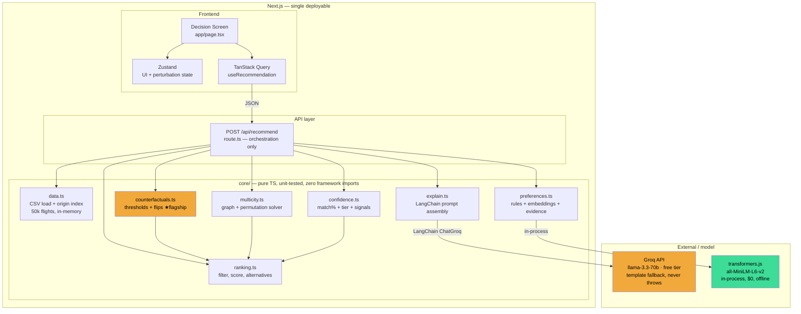
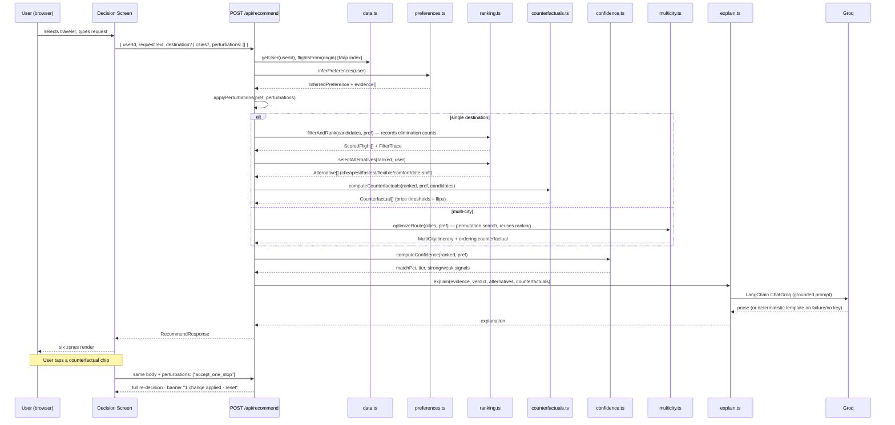

# Threshold — Architecture Document v2

> **Audience**: AI coding agents (Claude Code, Cursor, etc.) implementing this system, and the human reviewing their output. Every section is directly executable — schemas, routes, and component contracts are specified precisely enough to implement without further clarification. Companion to `product_spec_v2.md` (the what and why); this is the exact how. Mermaid diagrams render natively in GitHub, VS Code, and Obsidian.

---

## 1. System overview

**One deployable.** A single Next.js (App Router) application. Business logic lives in `core/` — pure TypeScript modules with zero framework imports — called from one API route. No NestJS, no Prisma, no SQLite (decision and rationale recorded in `product_spec_v2.md` §8; the pure `core/` boundary keeps it reversible in ~30 minutes if a rule mandates a separate backend).



**The architectural statement for judges** (put it verbatim in the deck): every decision — filtering, scoring, alternatives, counterfactuals, confidence — is deterministic, auditable TypeScript. The LLM touches the system in exactly two places: fuzzy language understanding on the way in (embedding-similarity preference signals), natural prose on the way out (explanation). It never ranks, never decides, and both touchpoints degrade to deterministic fallbacks. That's why the counterfactual math is possible at all: you can't invert an opaque LLM ranking, but you can invert a linear scoring function.

---

## 2. Request lifecycle

Two flows share one endpoint: the initial request, and the counterfactual chip tap (same pipeline, with a `perturbations` array applied before ranking).



---

## 3. Data layer — `core/data.ts`

No database. The toolkit dataset is ~50,000 flight rows + ~50 user rows: static, read-only, ~15MB in memory. A database adds seed scripts, migrations, and deploy state for zero judge-visible value.

```typescript
// core/data.ts — parse once, index once, serve forever
import Papa from "papaparse";

interface DataStore {
  users: Map<string, UserRow>;
  flightsByOrigin: Map<string, FlightRow[]>;        // THE hot path
  flightsByRoute: Map<string, FlightRow[]>;          // key: `${origin}-${destination}`
  airports: Map<string, { code: string; city: string }>;
}

let store: DataStore | null = null;                  // module-scope singleton

export function getStore(): DataStore {
  if (!store) store = buildStore(parseCsvs());       // lazy init on first request
  return store;
}
```

Engineering rules:
- **Parse at boot, never at request time.** Lazy singleton in module scope; in `next dev`, attach to `globalThis` so hot-reload doesn't re-parse 50k rows on every edit.
- **Filter before scoring.** `flightsByRoute` lookup first; score normalization runs over a route's candidates (typically dozens), never the full file. This is what keeps ranking sub-millisecond — a number worth logging and quoting.
- **Schema-generic.** Never hardcode airport codes; the store is built entirely from whatever the CSVs contain. Empty route → structured "no inventory" response, never a fabricated flight.
- Parse numerics/booleans defensively at load time — one `coerceFlightRow()` function, unit-tested, so type bugs die at the boundary. The sample data makes the traps concrete: booleans arrive as Python-style `"True"`/`"False"` (capitalized — a naive `=== "true"` check silently makes every flight bag-less and non-refundable), `layover_airports` and `flight_numbers` are semicolon-delimited, `layover_airports` is empty-string for nonstops, and `departure_utc` is a full ISO timestamp whose **date component is load-bearing** — extract and index it, since the date-shift feature (§4.2 note below) works by grouping a route's candidates by departure date.
- Split `raw_history` on `" | "` at load time into discrete phrases. The sample users' histories are pipe-delimited quotable fragments ("broke student, absolute cheapest only", "traveling w/ 2 kids, direct is worth paying for") — storing them pre-split means the evidence panel can cite the exact phrase that fired a rule, verbatim, which is the personalization rubric line made visible.

---

## 4. Core modules — contracts

All of `core/` obeys three rules: **no framework imports** (Next/React types are forbidden — enforced by an ESLint `no-restricted-imports` override on the directory), **pure functions of their inputs** (except the two AI touchpoints, each with a never-throw fallback), **every module has a unit test file** run against the real CSVs plus small in-memory fixtures.

### 4.1 `preferences.ts` — exists, extended
As built. Two additions:
1. Every evidence entry gains a source tag so `confidence.ts` can compute signal agreement:
```typescript
interface EvidenceItem {
  text: string;                      // human-readable, rendered verbatim in zone 2
  source: "structured" | "raw_history" | "embedding";
  dimension: "direct" | "cost" | "convenience" | "redeye" | "airline" | "cabin";
}
```
2. The embedding layer (transformers.js + archetype phrases, per v1 §3.7) appends `EvidenceItem`s with `source: "embedding"` citing the matched archetype and similarity. **Operational note: trigger the model download during setup today** — first run pulls a few hundred MB and must not happen on demo day. If the model fails to load, the rule layer alone proceeds; log a warning, never fail the request.

### 4.2 `ranking.ts` — exists, extended
Scoring function unchanged (its linearity is load-bearing — see 4.3). Additions:

```typescript
// Elimination bookkeeping for the trace panel (zone 6)
interface FilterTrace {
  steps: { constraint: string; removed: number; remaining: number }[];
  // e.g. { constraint: "layover ≤ 240min", removed: 12, remaining: 35 }
}
export function filterAndRank(...): { ranked: ScoredFlight[]; trace: FilterTrace };

// Generalizes the old tradeOffSummary() — same argmin/argmax pattern, five categories
type AlternativeKind = "cheapest" | "fastest" | "flexible" | "comfort" | "date_shift";
interface Alternative {
  kind: AlternativeKind;
  flight: FlightRow | null;          // null → honest empty state ("no refundable options")
  gain: string;                      // "save $120" | "arrive 2h earlier" | "refundable"
  cost: string;                      // "+5.1h" | "+$260"
  deltaPrice: number;
  deltaMinutes: number;
}
export function selectAlternatives(ranked: ScoredFlight[], user: UserRow): Alternative[];
```
`date_shift` searches candidates within ±`user.date_flexibility_days` of the requested date. Implementation grounded in the actual data shape: a route's flights cluster on specific departure dates, so build the comparison as `bestByDate: Map<isoDate, ScoredFlight>` over the route and diff the requested date's best against neighbors inside the window. If the user's flexibility is 0, return the alternative with `flight: null` and a gain string of "your dates are fixed" — respecting the constraint is displayed, not hidden.

Also: `ScoredFlight` gains a `breakdown: Record<string, number>` of per-component score contributions, rendered in the trace panel's candidates stage.

### 4.3 `counterfactuals.ts` — NEW, the flagship

```typescript
type Perturbation =
  | { kind: "price_drop"; flightId: string; toPrice: number }     // Type 1
  | { kind: "accept_one_stop" }                                    // Type 2 flips ↓
  | { kind: "bags_matter" }
  | { kind: "evening_ok" }
  | { kind: "ignore_loyalty" }
  | { kind: "shift_dates"; days: number };

interface Counterfactual {
  perturbation: Perturbation;
  label: string;               // "United 88 wins if its fare drops below $543"
  newWinner: ScoredFlight;
  flips: boolean;              // trace panel also shows the ones that DIDN'T flip
}

export function computeCounterfactuals(
  ranked: ScoredFlight[], pref: InferredPreference, candidates: FlightRow[]
): Counterfactual[];

export function applyPerturbations(
  pref: InferredPreference, ps: Perturbation[]
): InferredPreference;         // pure — returns a modified copy for the chip-tap re-run
```

**Type 1 — closed-form price thresholds.** For each of the top 2–3 challengers, solve the linear break-even (spec §4). Implementation notes that a judge will probe:
- Hold the candidate set's min/max normalization bounds fixed while solving; state this in a code comment *and* the README assumptions section.
- The demand/holiday multipliers scale the whole score, so they multiply through the algebra — include them, don't approximate.
- Clamp: if the required drop exceeds 60% of fare, emit `label: "no realistic price makes this win"` with `flips: false`.
- **Unit-test the algebra by verification**: for each computed threshold, set the challenger's price to `threshold − $1`, re-run `filterAndRank`, assert the winner actually changed. The solver is only trusted because the re-run confirms it.

**Type 2 — perturb and re-rank.** Apply each toggle via `applyPerturbations`, re-run `filterAndRank` over the route's candidates, keep flips. Display cap: 4, smallest perturbations first. All non-flips still ship in `trace` — "nothing else within reason changes this decision" must be backed by the receipts.

### 4.4 `confidence.ts` — NEW, small

```typescript
interface Confidence {
  matchPct: number;            // score(#1) / maxAchievableScore(pref) — see spec §6
  tier: "high" | "medium" | "low";   // margin(#1,#2) × signal agreement
  strongSignals: string[];     // dimension supported by ≥2 evidence sources → ✓
  weakSignals: string[];       // single-source or conflicting → •
}
export function computeConfidence(ranked: ScoredFlight[], pref: InferredPreference): Confidence;
```
`maxAchievableScore` = score of a hypothetical flight maxing every component under this user's weights (including the ×1.05 low-demand multiplier ceiling). Tier thresholds: margin > 0.10 → high, < 0.04 → low, else medium; conflicting strong signals demote one tier. Hard rule from the spec: every displayed number traces to a function a judge can be walked through in ten seconds.

### 4.5 `multicity.ts` — kept from v1 plan
Graph over airports in the dataset, edges weighted by the ranking scorer; unordered city sets solved by exact permutation search (≤6 cities — provably optimal at this scale; the OR-Tools trade-off note survives verbatim in the README). Two v2 additions: emit an **ordering counterfactual** ("Paris-first wins unless ROM→PAR drops below $95" — same break-even solver applied at the leg level) and itinerary-level alternatives, so multi-city renders through the same six zones. Enforce temporal sanity across legs (leg *n+1* departs after leg *n* arrives plus a minimum turnaround).

### 4.6 `explain.ts` — exists, prompt extended
Port as-is; extend the prompt with the alternatives, counterfactuals, and confidence tier, with the same grounding rule (reference provided evidence only, never invent) and the same discipline: no `GROQ_API_KEY` or any network/parse failure → deterministic template built from the evidence trail. **The LLM phrases; it never decides.** Rate-limit note stands: ~30 req/min on the free tier — never call in a test loop.

---

## 5. API — one route

| Method | Path | Body | Returns |
|---|---|---|---|
| `POST` | `/api/recommend` | `RecommendRequest` | `RecommendResponse` |
| `GET` | `/api/users` | — | `UserSummary[]` (traveler picker: id, home airport, raw_history preview) |

That's the whole surface. No health checks, no debug endpoints, no audit-trail persistence — cut with reasons in the spec.

```typescript
interface RecommendRequest {
  userId: string;
  requestText: string;
  destination?: string;          // single-leg mode
  cities?: string[];             // multi-city mode (presence selects the mode)
  perturbations?: Perturbation[]; // chip taps — empty on first request
}

interface RecommendResponse {
  mode: "single-leg" | "multi-city";
  verdict: ScoredFlight;                 // multi-city: itinerary's first-leg anchor
  ranked: ScoredFlight[];                // collapsed list, rubric coverage
  preference: InferredPreference;        // includes EvidenceItem[]
  alternatives: Alternative[];
  counterfactuals: Counterfactual[];
  confidence: Confidence;
  trace: TraceStage[];                   // §7 of the spec — real payloads per stage
  explanation: string;
  itinerary?: MultiCityItinerary;
  appliedPerturbations: Perturbation[];  // echoed back → drives the "1 change applied" banner
}

interface TraceStage {
  id: "request" | "preferences" | "constraints" | "candidates" | "tradeoffs" | "counterfactuals" | "verdict";
  label: string;
  payload: unknown;              // the real data: evidence[], FilterTrace, breakdowns, non-flips
}
```

The route handler is orchestration only — sequence the core modules, assemble the response, zero business logic. Validate the body with `zod` at the boundary (lighter than class-validator, no decorators, fits route handlers). Errors return structured `{ error, message }`, never a stack trace.

---

## 6. Frontend

### 6.1 Route map

```
app/
  layout.tsx        — fonts + providers
  globals.css       — design tokens (§6.2), the ONLY place raw colors/fonts exist
  page.tsx          — the Decision Screen (the entire product)
  loading.tsx       — route-level skeleton
  error.tsx         — route-level error boundary
```

One page. The v1 deep-link route (`recommendation/[id]`) is cut with the audit trail. Do not add routes.

### 6.2 Design system — single source of truth

Carried forward from v1 unchanged — the token architecture was right. Everything visual is a CSS custom property in `globals.css`; Tailwind reads the variables; components consume token classes and **never** write raw hex or ad-hoc `style={{}}` (runtime data-driven values excepted).

```css
:root {
  /* primitives — referenced ONLY by the semantic layer */
  --color-navy-950:#070B14; --color-navy-900:#0B1220; --color-navy-800:#121B30;
  --color-navy-700:#1B2740; --color-cloud-100:#F5F3EE; --color-cloud-300:#C9CDDA;
  --color-cloud-500:#8B93A6; --color-amber-400:#F6BE5C; --color-amber-500:#F2A93B;
  --color-amber-600:#D98F22; --color-green-500:#3DDC97; --color-red-500:#E2695B;

  /* semantic tokens — what components actually use */
  --bg-base:var(--color-navy-900); --bg-surface:var(--color-navy-800);
  --bg-surface-raised:var(--color-navy-700);
  --text-primary:var(--color-cloud-100); --text-secondary:var(--color-cloud-500);
  --text-on-accent:var(--color-navy-950); --border-default:var(--color-navy-700);
  --accent:var(--color-amber-500); --accent-hover:var(--color-amber-400);
  --signal-positive:var(--color-green-500); --signal-negative:var(--color-red-500);

  --font-display:'Season Mix',serif; --font-body:'Matter',sans-serif;
  --font-mono:'JetBrains Mono',monospace;   /* prices, flight numbers, evidence, thresholds */
  --radius-sm:6px; --radius-md:10px; --radius-lg:16px;
}
```

Tailwind config maps tokens exactly as in v1 (`bg-surface`, `text-text-secondary`, `rounded-md`, …). Fonts via `next/font/local` with the v1 fallback plan (Fraunces/Inter through `next/font/google` if the licensed files aren't on disk — the CSS variable names don't change, so nothing else does). **Counterfactual thresholds and all money/time numbers render in `--font-mono`** — the Bloomberg-density cue is typographic, not decorative.

### 6.3 Component inventory — the six zones

**Rule: no bare HTML in feature code.** Primitives (`<Container>` `<Stack>` `<Text>` `<Button>` `<Card>` `<Badge>` `<Skeleton>` `<EmptyState>`) carry over from v1 verbatim — build them first, exactly as specified there. shadcn/ui for anything not listed (dropdowns, tooltips, sheets); never hand-roll those.

| Component | Zone | Purpose | Key props |
|---|---|---|---|
| `<VerdictCard>` | 1 | The single recommended flight: airline, route, price, arrival, match% + tier badge. Readable from across a room. | `flight: ScoredFlight`, `confidence: Confidence` |
| `<EvidencePanel>` | 2 | "Why this one" — evidence rendered verbatim, ✓ strong / • weak per item. | `evidence: EvidenceItem[]`, `strong: string[]`, `weak: string[]` |
| `<OpportunityCostPanel>` | 3 | Five `<AlternativeRow>`s; gain and cost both shown; explicit empty rows. | `alternatives: Alternative[]` |
| `<AlternativeRow>` | 3 | One trade: kind label, flight stub, `gain` in positive tone, `cost` in negative tone. | `alternative: Alternative` |
| `<CounterfactualChip>` | 4 | **The demo moment.** Tappable boundary statement; tap → refetch with the perturbation appended. | `cf: Counterfactual`, `onApply(p: Perturbation)` |
| `<PerturbationBanner>` | 4 | "1 change applied · reset" strip when `appliedPerturbations.length > 0`. | `applied: Perturbation[]`, `onReset()` |
| `<ConfidenceBadge>` | 5 | Tier pill + match% (mono font); Low tier links the eye to zone 4. | `confidence: Confidence` |
| `<TraceBar>` | 6 | Horizontal 7-stage pipeline; each node opens a `<TraceStageSheet>`. | `trace: TraceStage[]` |
| `<TraceStageSheet>` | 6 | shadcn Sheet showing the stage's real payload (elimination counts, score breakdowns, non-flips). | `stage: TraceStage` |
| `<RankedListCollapse>` | — | Collapsed full ranking, one tap to expand — rubric coverage without diluting the verdict. | `ranked: ScoredFlight[]` |
| `<ItineraryTimeline>` | 1 (multi-city) | Ordered legs; each leg tap scopes zones 2–4 to that leg. | `itinerary: MultiCityItinerary` |
| `<TravelerPicker>` | header | Dropdown + raw_history preview. | `users: UserSummary[]`, `value`, `onChange` |
| `<RequestInput>` | header | Free text + submit; multi-city detected by `cities` parse, manual toggle as fallback. | `onSubmit`, `loading?` |

Every data-bearing component ships with a `<Skeleton>` state and an `<EmptyState>` state — nothing ever renders blank.

### 6.4 State management

- **TanStack Query** — one `useRecommendation(request)` mutation-style hook owns all server state. Components never `fetch`.
- **Zustand** — one small `useDecisionStore`: `selectedUserId`, `requestText`, `mode`, and `appliedPerturbations: Perturbation[]`. A chip tap appends to `appliedPerturbations` and re-fires the hook with the same request body + the array; reset clears it. The counterfactual interaction is therefore ~15 lines of state code — the pipeline does the work.
- Rule unchanged from v1: anything derivable from the query result never gets duplicated into Zustand.

---

## 7. Tooling — trimmed for a 36-hour solo build

Kept: **strict TypeScript** (`"strict": true`, `no-explicit-any: error`) and ESLint with two high-value rules — the v1 `react/forbid-elements` rule (enforces the no-bare-HTML convention at lint time) and a `no-restricted-imports` override forbidding `next/*` and `react` inside `core/` (enforces the purity boundary that the whole architecture story rests on — this rule *is* the architecture, mechanically).

Cut, with reasons on record: Husky + lint-staged (pre-commit ceremony for a solo repo with no collaborators protects nobody; run `npm run lint && npm run build` manually before recording the demo and before submitting — put it in the README as the release checklist). Prettier stays as an editor-level formatter, not a git hook.

Tests: **Vitest**, colocated `*.test.ts` beside each core module. The non-negotiable suites: counterfactual break-even verification (§4.3 — solve, perturb, re-rank, assert the flip), `selectAlternatives` empty-category handling, `confidence` tier boundaries, multicity temporal-sanity, and a smoke test running every benchmark prompt from `benchmark_prompts.json` through the full pipeline asserting a non-empty, well-shaped response. That last file is the toolkit's own definition of expected behavior — it runs in CI-of-one before every demo recording.

---

## 8. Folder structure

```
threshold/
├── app/
│   ├── layout.tsx
│   ├── globals.css                  # design tokens — only place raw values exist
│   ├── page.tsx                     # the Decision Screen
│   ├── loading.tsx
│   ├── error.tsx
│   └── api/
│       ├── recommend/route.ts       # orchestration only
│       └── users/route.ts
├── core/                            # pure TS — the judged artifact
│   ├── data.ts          + data.test.ts
│   ├── preferences.ts   + preferences.test.ts
│   ├── ranking.ts       + ranking.test.ts
│   ├── counterfactuals.ts + counterfactuals.test.ts   # ★
│   ├── confidence.ts    + confidence.test.ts
│   ├── multicity.ts     + multicity.test.ts
│   ├── explain.ts       + explain.test.ts             # fallback-path tests only
│   ├── benchmark.test.ts            # every benchmark_prompts.json prompt, end to end
│   └── types.ts
├── components/
│   ├── ui/                          # primitives (v1 inventory) + shadcn
│   └── decision/                    # the zone components (§6.3)
├── lib/
│   ├── store.ts                     # zustand: useDecisionStore
│   └── queries.ts                   # tanstack: useRecommendation, useUsers
├── data/
│   ├── flights_data.csv             # ~50,000 rows
│   ├── user_data.csv                # ~50 rows
│   └── benchmark_prompts.json
├── public/fonts/
├── product_spec_v2.md
└── README.md                        # setup · assumptions · limitations · future work
```

---

## 9. Relationship to the spec

`product_spec_v2.md` owns the what and why: the Decision Screen, the six zones, the counterfactual math, the build order, the deliverables checklist, and the judging map. This document is the how: contracts, diagrams, tokens, components, and the engineering rules that make "deterministic core, LLM at the edges" true in code rather than just on a slide. Hand an implementing agent both files; the spec's §10 build order governs sequencing, and this document is what each step builds against.